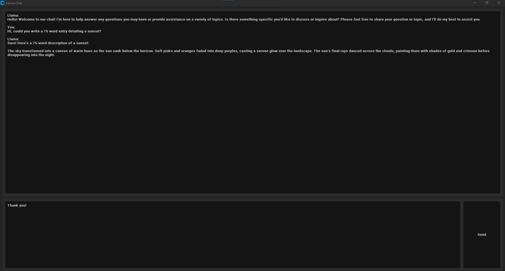

## Note:
The ctk_button.py from `customtinker` was modified to remove the `<button-1>` binding in order to allow for specific colors 
when the button is clicked by `"button-1"`

**Read me** to be completed in full at a later date.

---
### In lue of a completed ReadMe:
The application is a chat interface for Ollama LLMs that have been installed and ran locally.

The user will need to install Ollama and download a model.

This application was developed in a Windows 10 env, using conda.

Details on download & installing Ollama, as well as downloading your first model:

- [Ollama Windows Preview](https://ollama.com/blog/windows-preview)

The will need to create a `model_path.py` file
* Add two variables in this file:
  * OLLAMA_EXE_PATH = '/path/to/the/ollama.exe'
  * LLAMA2_MODEL = "llama2:13b" 
    * This needs to be the name of the model downloaded & wanted to run

The application will run http://localhost:11434 to host the LLM and use http://localhost:11434/api/generate to generate 
responses.

---
Screenshot of the application:

